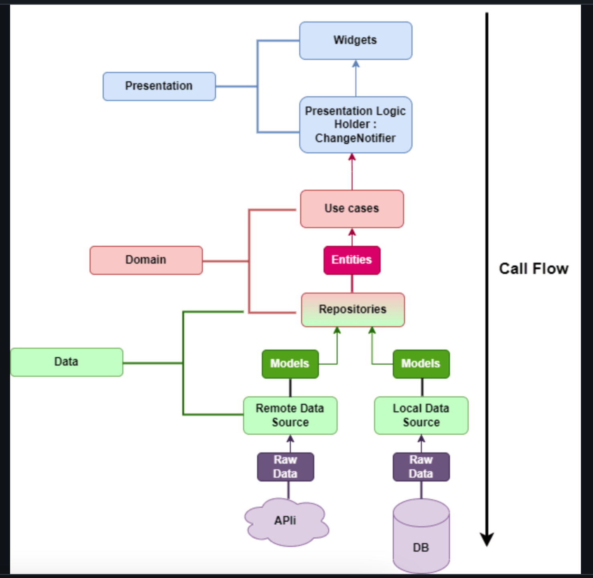

# Tasks & Reminders (Offline-first) - Scaffold

## Getting Started

translation:
dart run slang

I follow clean arch

in Core you can find data & domain as they are shared in app with local & remote datasources & repository & repositoryImp

on features folder you can find usecases which are the business logic & presentation layer
